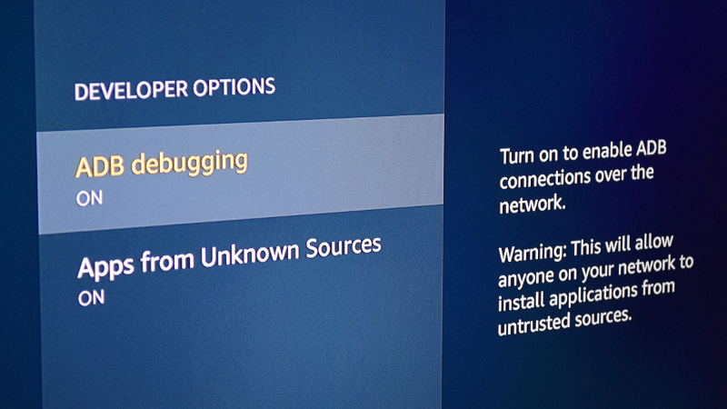

icestone
==
This is a simple Python script to detect Amazon Fire Sticks with ADB enabled on the local network.

Many guides have been published detailing how to "jailbreak" the Amazon Fire TV Stick, which have the user enable developer options without a clear explanation of what they do.

icestone demonstrates how these devices could be potentially exploited.

Payload
==
icestone does not currently include a "payload", that is, it makes no attempt to exploit the devices it discovers. If you wish to implement a payload, you do so at your own risk.

Requirements
==
icestone requires [arp-scan](https://github.com/royhills/arp-scan) to be installed on the system. Also be sure to update the manufacturer database to ensure accurate device detection.

License
==

The software is distributed under a BSD 3 clause license in the hope that it
will be useful, but WITHOUT ANY WARRANTY; without even the implied warranty of
MERCHANTABILITY or FITNESS FOR A PARTICULAR PURPOSE.

For details, see the file "[LICENSE](LICENSE)" in the source directory.
